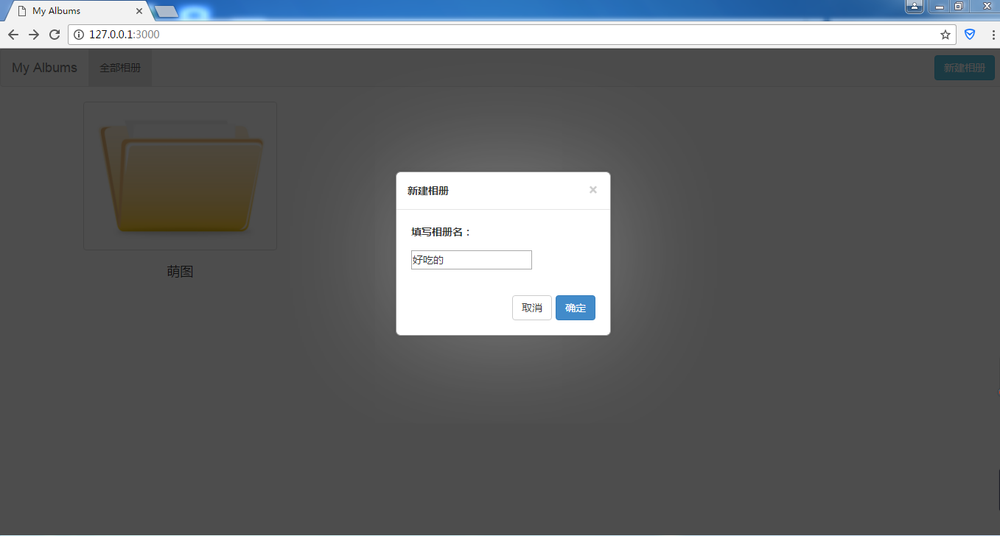
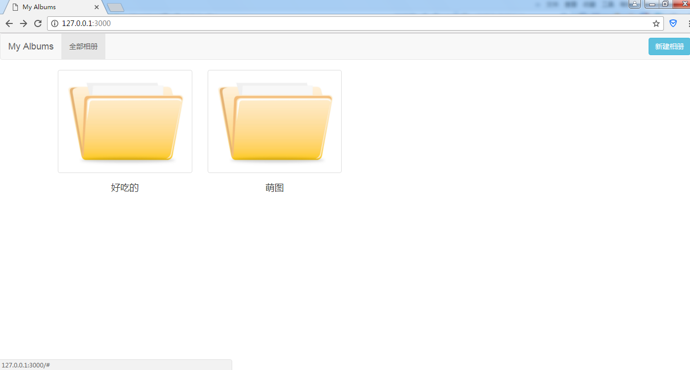
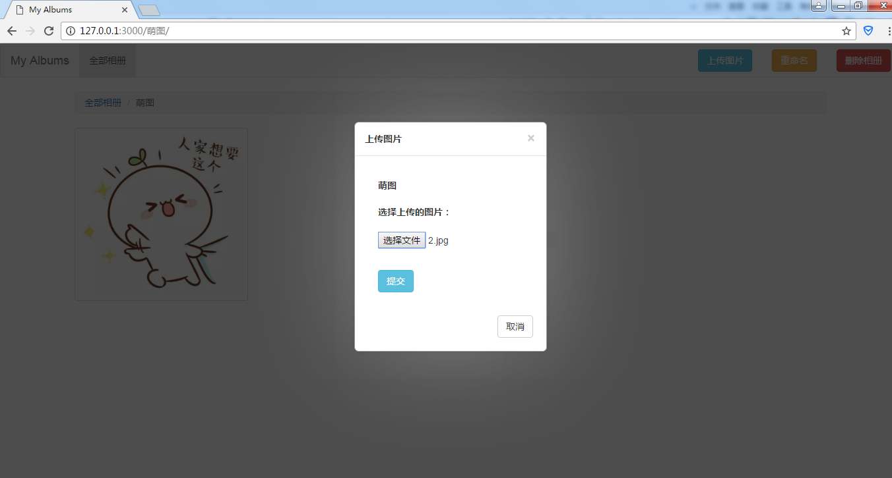
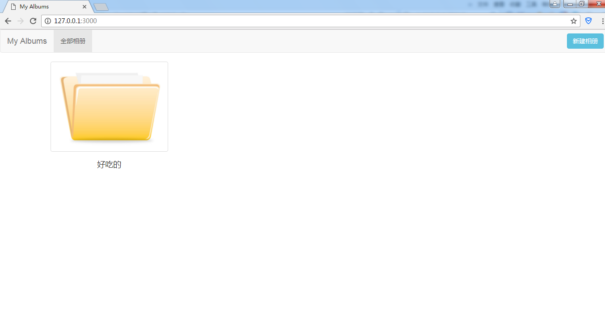
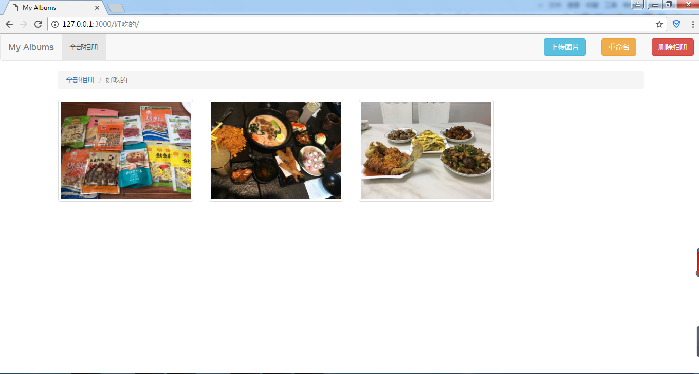
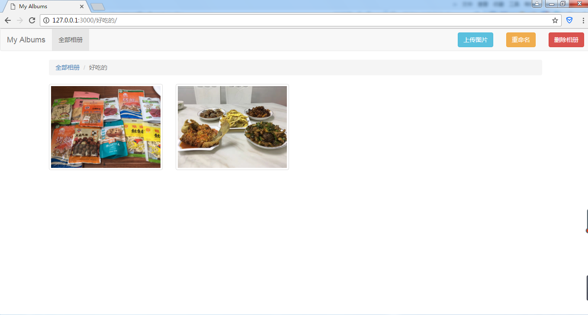

###   基于Node（bootstrap+ejs+express+formidable+fs-extra）制作的在线相册资源管理器

#### 一、项目功能概述：
该项目实现的是一个基于`Node`的在线相册资源管理器，其中采用`bootstrap`来进行页面布局，采用`ejs`后台模板引擎与`express`后台框架来进行基本的页面渲染和路由处理，采用`formidable`来处理`post`提交的数据及图片上传的业务，采用`fs-extra`来进行扩展性的文件处理。我们可以在主页面进行新建相册的功能，在具体的相册目录下，可以进行图片上传，相册重命名及删除该相册的功能，当点击相册内某一张图片时，可以查看大图，并且可以选择是否删除该图片。
> 该项目采用`MVC`的结构进行开发，主入口文件为`app.js`，在`controller`文件夹下的`router.js`模块主要负责提供路由处理函数，在`models`文件夹下的`file.js`模块主要负责提供文件处理函数，`views`文件夹主要提供视图页面。其中`upload`文件夹主要用于存储我们新建的相册文件夹及上传的图片，`temp`文件夹主要作为图片上传过程的中转站，`public`文件夹是该项目的一个静态资源文件夹，用于存放该项目当中所有的静态资源。当运行该项目时，可以在该项目文件夹下，在`cmd`当中键入命令`-> node app.js`，然后在打开浏览器输入 `http://127.0.0.1:3000` 即可进入主页面。

#### 二、项目细节展示：
我们可以在主页面点击右上角的新建按钮，可以在弹出框当中输入我们新建相册的名字，点击确定即可完成相册的新建。

我们点击某个相册，即可进入该相册内部，查看该相册内的图片，在该相册目录下，点击右上角的上传图片按钮，即可在弹出框当中进行图片上传的选择，点击上传按钮后即可将我们本地的图片上传至该相册当中。

在该相册目录下，点击右上角的重命名按钮，可以在弹出框内输入新的相册名，点击确定后就可以完成对该相册的重命名。

在该相册目录下，点击右上角的删除按钮，即可弹出如下的弹出框，在弹出框内点击确定后，即可完成该相册的删除。

在该相册目录下，当点击某一张图片时，会弹出如下的弹出框，可以查看大图。

当选择点击该弹出框当中的删除按钮，会弹出如下弹出框，当点击确定之后，即可完成该图片的删除。

